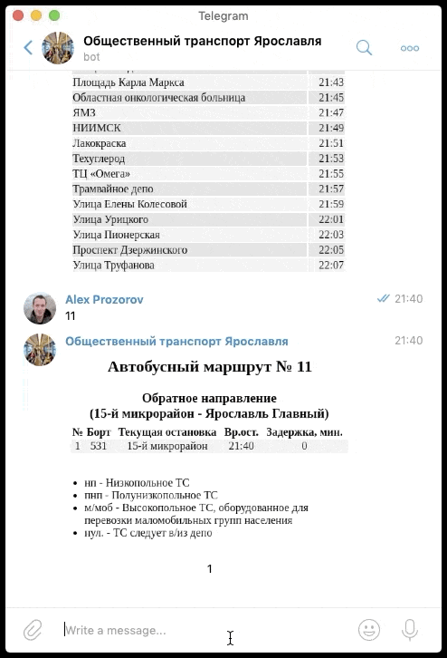

# yartr_bot
Telegram-бот для планирования поездки на общественном транспорте г. Ярославля. 
Доступны данные о наличии транспорта на маршруте с точностью до остановок и проноз прохождения конкретного борта. Для автобусов, троллейбусов, трамваев и маршрутных такси.  

Для получения текущей информации по маршруту достаточно ввести номер маршрута, например:

**33**, **85к** или **7**.

При совпадении номера маршрута для нескольких типов городского транспорта можно указать необходимый тип транспорта, например:

**трамвай 1**, **троллейбус 7** или **маршрутка 5**.

Допустимы сокращения, например: 

**трам**, **трол**, **авт**, **марш**.

Информация предоставлена [МУП ГПТ \"Яргортранс\"](http://ot76.ru)
